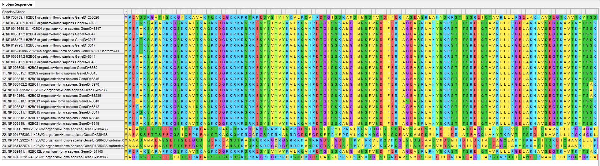
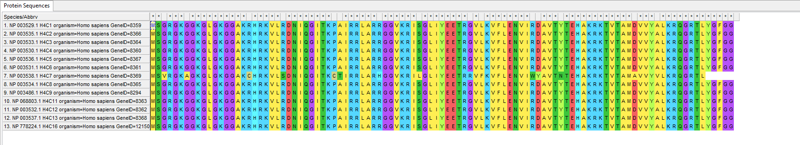

# Групповой проект по биоинформатике
Индивидуальная часть группового проекта по биоинформатике. Антон Андрущенко, группа 1 (H2A/H2B)

## Описание белка

Белок ALKBH1 связан с модификацией белка H2A, выполняет запись эпигенетической метки. Cсылки на статьи:

1. [ALKBH1 is a histone H2A dioxygenase involved in neural differentiation](https://pubmed.ncbi.nlm.nih.gov/22961808/)
2. [Role of ALKBH1 in the Core Transcriptional Network of Embryonic Stem Cells](https://pubmed.ncbi.nlm.nih.gov/26765775/)

Доменная структура:

Экспрессия в тканях:

Как видим, экспрессируется в основном в яичниках, груди и мозжечке.

## Выравнивания

### H2A

### H2B

### H3

### H4

## Таблицы с e-value

Логарифмированные:
|proteom|human|mouse|zebrafish|drosophila|c\.elegans|ciliate|yeast|methanocaldococcus|thermococcus|e\.coli|tuberculosis|
|---|---|---|---|---|---|---|---|---|---|---|---|
|alhkb1|300\.0|300\.0|144\.8664610916298|63\.64016451766011|32\.27164621797877|27\.177178354696895|0\.0|0\.0|0\.0|14\.377785977033705|0\.0|
|h2a|88\.78781239559605|88\.30102999566398|81\.46218090492673|67\.28650945690606|64\.87289520163519|56\.21824462534753|0\.0|0\.0|0\.0|0\.0|0\.0|
|h2b|87\.76955107862173|85\.87942606879415|80\.92811799269387|58\.226945306635734|63\.379863945026244|49\.04143611677803|0\.0|0\.0|0\.0|0\.0|0\.0|
|h3|95\.65955588515988|95\.81247927916354|94\.75202673363819|95\.02733440773389|93\.35066514128786|85\.07520400420209|0\.0|0\.0|0\.0|0\.0|0\.0|
|h4|66\.96257350205937|67\.11918640771921|67\.94692155651659|67\.09582563171584|67\.21112488422459|44\.707743928643524|0\.0|0\.0|0\.0|0\.0|0\.0|

Нелогарифмированные:
|proteom|c\.elegans|ciliate|drosophila|e\.coli|human|methanocaldococcus|mouse|thermococcus|tuberculosis|yeast|zebrafish|
|---|---|---|---|---|---|---|---|---|---|---|---|
|alhkb1|5\.35e-33|6\.65e-28|2\.29e-64|4\.19e-15|1e-300|1\.0|1e-300|1\.0|1\.0|1\.0|1\.36e-145|
|h2a|1\.34e-65|6\.05e-57|5\.17e-68|1\.0|1\.63e-89|1\.0|5e-89|1\.0|1\.0|1\.0|3\.45e-82|
|h2b|4\.17e-64|9\.09e-50|5\.93e-59|1\.0|1\.7e-88|1\.0|1\.32e-86|1\.0|1\.0|1\.0|1\.18e-81|
|h3|4\.46e-94|8\.41e-86|9\.39e-96|1\.0|2\.19e-96|1\.0|1\.54e-96|1\.0|1\.0|1\.0|1\.77e-95|
|h4|6\.15e-68|1\.96e-45|8\.02e-68|1\.0|1\.09e-67|1\.0|7\.6e-68|1\.0|1\.0|1\.0|1\.13e-68|

## Тепловая карта

## Выводы

Судя по тепловой карте, впервые рассматриваемая модификация появляется у инфузорий.
